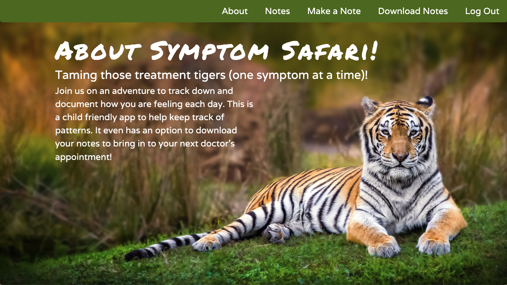
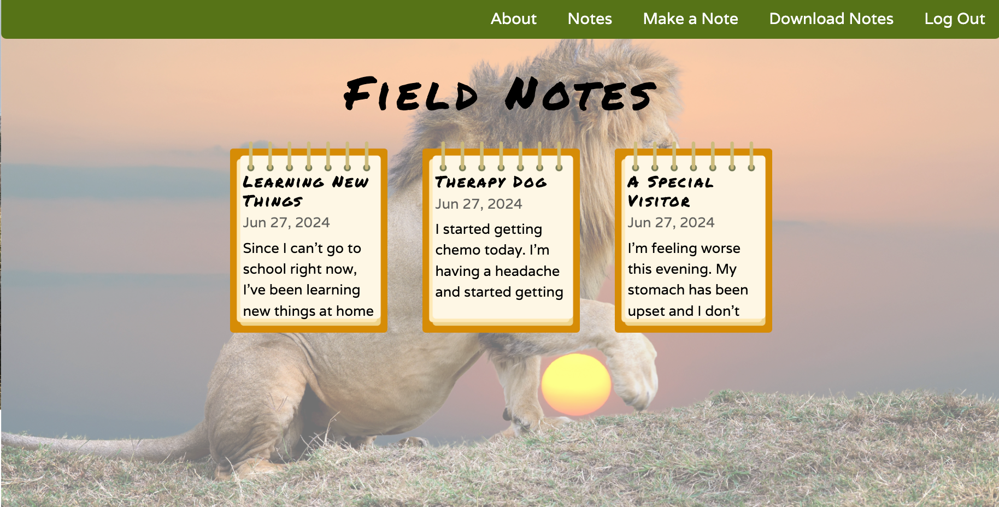
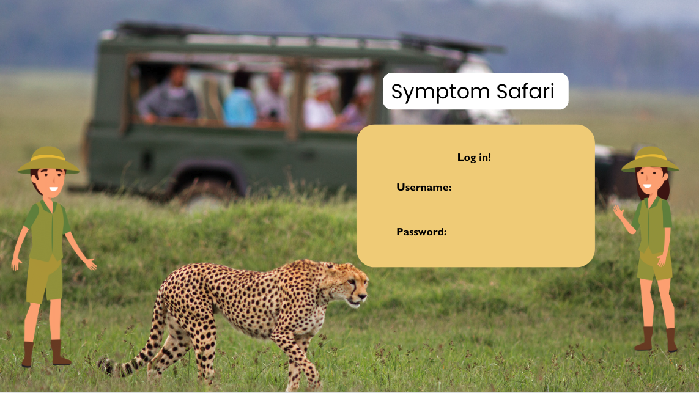
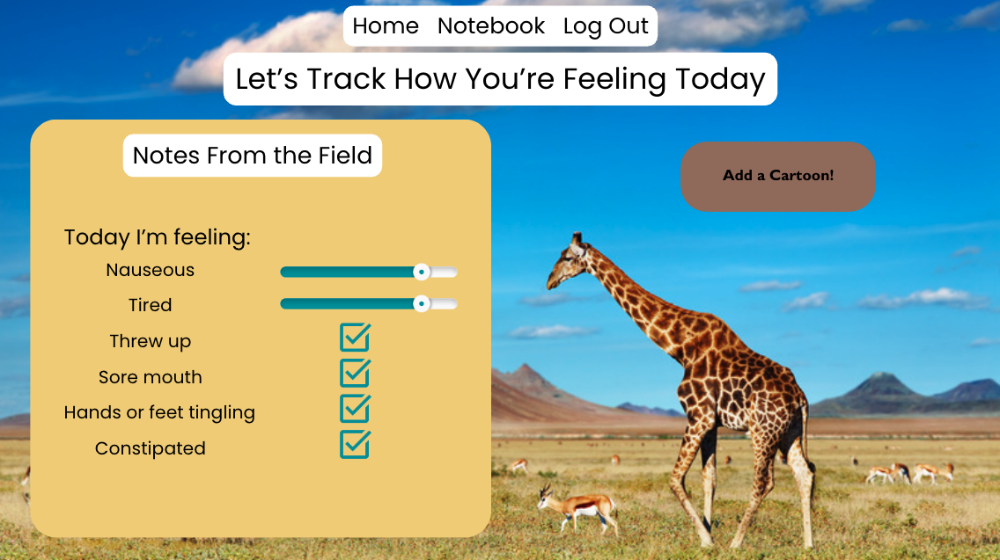
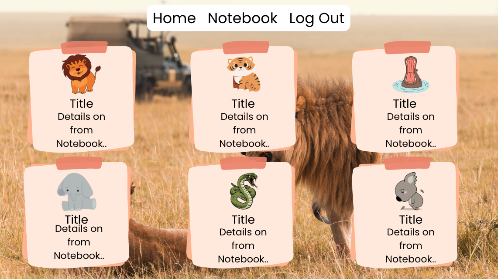
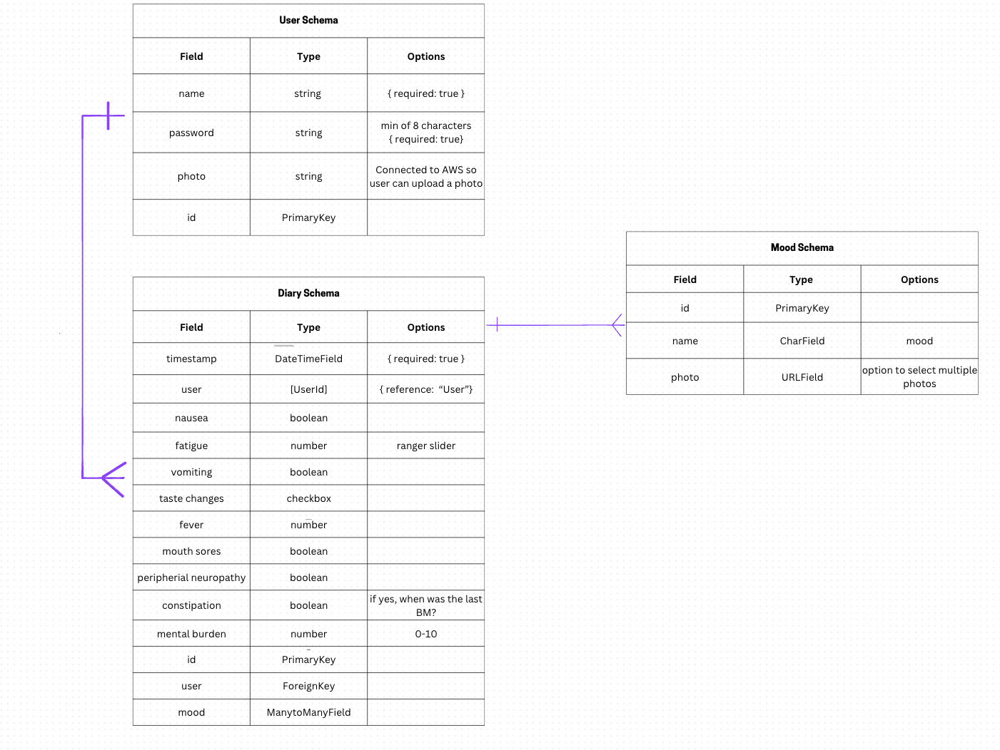

# Symptom Safari 
Come join us on the Symptomm Safari! This website is targed towards pediatric oncology patients. They are able to navigate the website and encounter different wild animals while documenting their daily symptoms. The website offers an option to even export their notes into a pdf to give to their doctor!

This website has been created with Django & Python during General Assembly's Software Engineering Bootcamp. 

## Instructions
You can find the website here: https://symptom-safari-55bde9365a18.herokuapp.com/
Make sure you create a user profile. Have fun on the Safari! 
##  Sneak Peek

##  Planning 

##  Technologies used

##  Attirbutions
Fonts: https://fonts.google.com/
 
Illustrations and Photos: https://www.canva.com/

##  Challenges Encountered During Development
I envisioned a seamless feature for users to export their journal entries to PDF, essential for sharing with healthcare providers. Although our coursework didn't cover this, I took the initiative to research and implement it using Django. Through Django's documentation, I discovered ReportLab and swiftly set it up. I then delved deeper into customizing and designing the PDF output to ensure a user-friendly and professional result.

##  Next Steps
&#9744; Add a parent user, who is able to write their own notes. With the option for a child over 13 being able to chose if they want their parents able to see their notes.
 
&#9744; Add animal noises with different actions.
