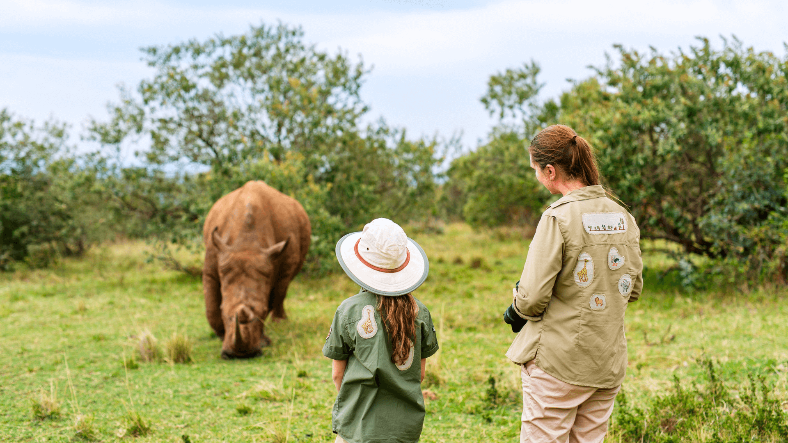

# Symptom Safari 
Python &amp; Django application completed during General Assembly's Software Engineering Bootcamp where pediatric oncology patients are able to log their symptoms each day. 

# Sneak Peek

# Planning 

# Technoligies Used

# Attirbutions
Fonts: https://fonts.google.com/
 
Illustrations and Photos: https://www.canva.com/

# Next Steps
&#9744; Add a parent user, who is able to write their own notes. With the option for a child over 13 being able to chose if they want their parents able to see their notes.
 
&#9744; Add animal noises with different actions.
